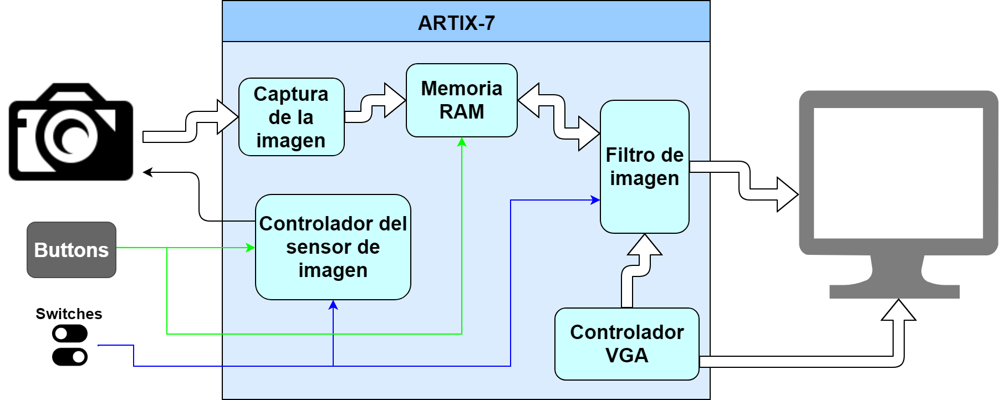

# Master thesis - image filtering with Xilinx FPGA
The system designed presents an image capture method using a CMOS image sensor (OV7670 board) which connects to an FPGA through the
Pmod interface. It also has a subsystem that allows communication via VGA with a monitor for the projection of the results obtained from the different filters.

## System architecture

